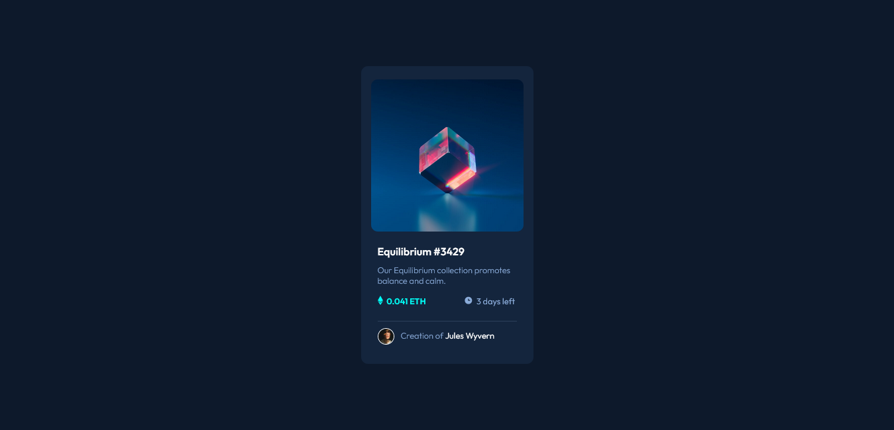

# Frontend Mentor - NFT preview card component solution

This is a solution to the [NFT preview card component challenge on Frontend Mentor](https://www.frontendmentor.io/challenges/nft-preview-card-component-SbdUL_w0U). Frontend Mentor challenges help you improve your coding skills by building realistic projects.

## Table of contents

- [Overview](#overview)
  - [The challenge](#the-challenge)
  - [Screenshot](#screenshot)
  - [Links](#links)
- [My process](#my-process)
  - [Built with](#built-with)
- [Author](#author)

## Overview

### The challenge

Users should be able to:

- View the optimal layout depending on their device's screen size
- See hover states for interactive elements

### Screenshot

### Links

- Solution URL: [Github](https://github.com/DantDev/Nft-preview)
- Live Site URL: [Nft Preview Card](https://profound-tulumba-1fa8b7.netlify.app/)

## My process

- I did this project using React.js , i used Vite to create the project , added the markup on HTML first , then i worked on the CSS , and for last i did the Hover States.

### Built with

- Semantic HTML5 markup
- Flexbox
- Vite
- [React](https://reactjs.org/) - JS library
- [Next.js](https://nextjs.org/) - React framework
- [Styled Components](https://styled-components.com/) - For styles

## Author

- Website - [Pedro Calixto](https://wondrous-chaja-b0f2e7.netlify.app/)
- Frontend Mentor - [@DantDev](https://www.frontendmentor.io/profile/DantDev)
- Instagram - [@p3drr0](https://www.instagram.com/p3drr0)
- GitHub - [@DantDev](https://github.com/DantDev)
